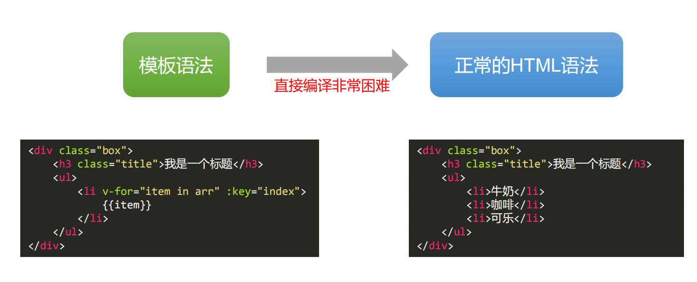
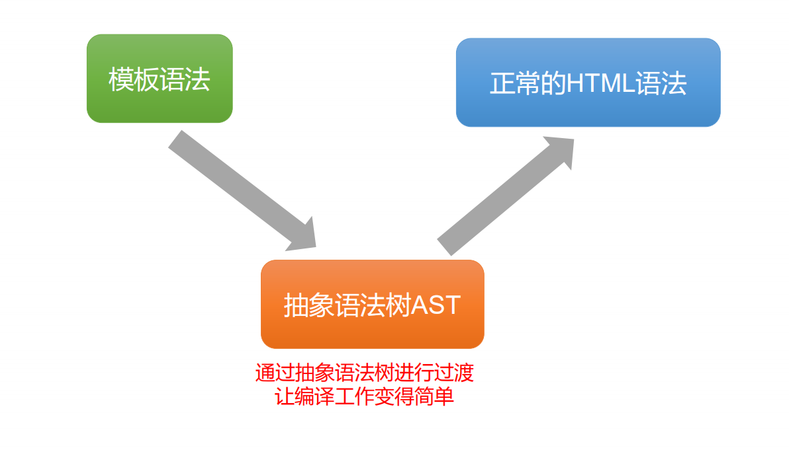
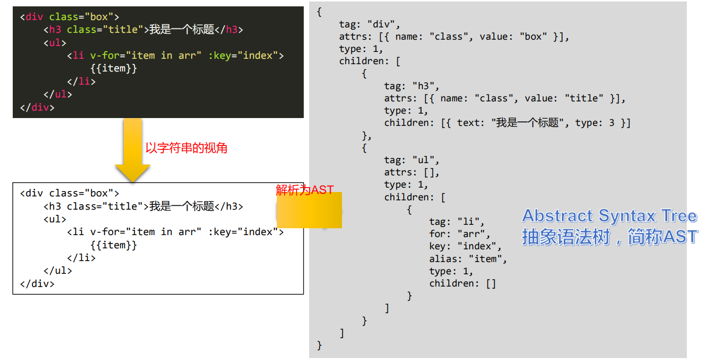

# AST抽象语法树

## 理论

`Abstract Syntax Tree` - 抽象语法树，简称 `AST`

AST本身就是一个对象，结构类似于树形








我们今天要做的就是把模板语法变成AST

## 实现

```js
/**
 * 正则
 * 1：attribute         属性        id="app" id='app' id=app
 * 2：ncname            标签名      <div></div>
 * 3：qnameCapture      标签名      <my:header></my:header>
 * 4：startTagOpen      开始标签    <div
 * 5：startTagClose     结束标签    > />
 * 6：endTag            结束标签    </div>
 * 
 */

// 
const attribute = /^\s*([^\s"'<>\/=]+)(?:\s*(=)\s*(?:"([^"]*)"+|'([^']*)'+|([^\s"'=<>`]+)))?/;
//标签名  <my-header></my-header>
const ncname = `[a-zA-Z_][\\-\\.0-9_a-zA-Z]*`;
// <my:header></my:header>
const qnameCapture = `((?:${ncname}\\:)?${ncname})`;
// <div
const startTagOpen = new RegExp(`^<${qnameCapture}`);
// > />
const startTagClose = /^\s*(\/?)>/;
// </div>
const endTag = new RegExp(`^<\\/${qnameCapture}[^>]*>`);

/*
<div id="app" style="color: red;font-size: 20px;">
    你好，{{ name }}
    <span class="text" style="color: green">{{age}}</span>
  </div>
*/

/**
 * 
 * @param {html 字符串} html 
 * @returns {Object}  AST
 */
function parseHtmlToAst(html) {

  let text,
    root,
    currentParent,
    stack = [];

  while (html) {
    // 开始标签判断，< 之前的都属于 文本节点
    let textEnd = html.indexOf('<');
    if (textEnd === 0) {
      const startTagMatch = parseStartTag();
      if (startTagMatch) {
        start(startTagMatch.tagName, startTagMatch.attrs);
        continue;
      }

      const endTagMatch = html.match(endTag);
      if (endTagMatch) {
        advance(endTagMatch[0].length);
        end(endTagMatch[1]);
        continue;
      }
    }
    if (textEnd > 0) {
      text = html.substring(0, textEnd);
    }

    if (text) {
      advance(text.length);
      chars(text);
    }
  }


  // 解析标签和属性
  function parseStartTag() {
    const start = html.match(startTagOpen);
    let end,
      attr;
    if (start) {
      // match 匹配结果，一个标签名，一个是属性
      const match = {
        tagName: start[1],
        attrs: []
      }
      advance(start[0].length);

      while (!(end = html.match(startTagClose)) && (attr = html.match(attribute))) {
        // 匹配到了属性，不是<div>，而是<div id=xxx>
        match.attrs.push({
          name: attr[1],
          value: attr[3] || attr[4] || attr[5]
        });
        advance(attr[0].length);
      }
      if (end) {
        advance(end[0].length);
        return match;
      }
    }
  }

  function advance(n) {
    html = html.substring(n);
  }

  // currentParent div
  //stack [div] 头部push，尾部pop
  function start(tagName, attrs) {
    // console.log('--------------开始--------------');
    // console.log(tagName, attrs);

    const element = createASTElement(tagName, attrs);
    debugger
    // console.log(element);
    // 判断头部标签
    if (!root) {
      root = element;
    }

    currentParent = element;
    stack.push(element);
  }

  function end(tagName) {
    // console.log('--------------结束--------------');
    // console.log(tagName);
    // span
    const element = stack.pop();
    // // div
    currentParent = stack[stack.length - 1];
    if (currentParent) {
      // span => parent => div
      element.parent = currentParent;
      // div => children => push => span
      currentParent.children.push(element);
    }
  }

  function chars(text) {
    // console.log('--------------文本--------------');
    // console.log(text);
    text = text.trim();

    if (text.length > 0) {
      currentParent.children.push({
        type: 3,
        text
      })
    }
  }

  function createASTElement(tagName, attrs) {
    return {
      tag: tagName,
      type: 1,
      children: [],
      attrs,
      parent
    }
  }
  return root;
}


export {
  parseHtmlToAst
}
```

